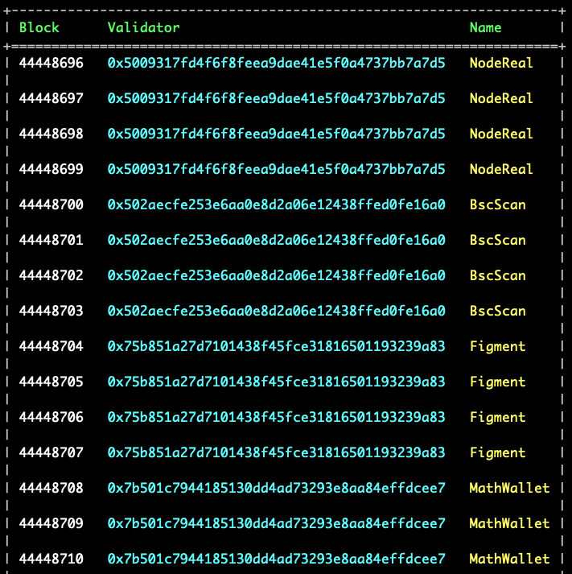

## BNB chain Leader Schedule

### How it works

Every 200 blocks, 21 validators are selected and recorded in the block header. This is called a validator snapshot.
Starting 44 blocks after the snapshot, these validators take turns proposing blocks. Each validator's turn lasts 4
blocks.

This is a simple utility to query the validator for a future block.

#### Leader schedule range:

The tool can determine the validator leader schedule up to 44 - 243 blocks into the future.

The exact range depends on the current block's position relative to the epoch boundary.

### Usage

```shell
$ cargo build --release
$ ./target/release/bnb-schedule --start 44448696 --end 44448730
```


